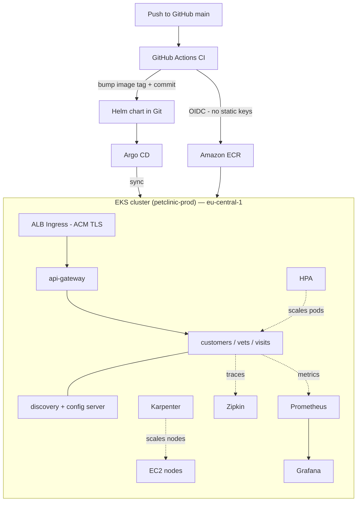

# petclinic-infrastructure

Infrastructure as Code for the [Spring PetClinic on AWS EKS](https://petclinic.ralphnetwork.online) solo project — a production-style GitOps platform built around a 7-service Java microservices application.

**Live app:** https://petclinic.ralphnetwork.online &nbsp;|&nbsp; **Full write-up:** [CASE-STUDY.md](../CASE-STUDY.md)

| Repo | Purpose |
|------|---------|
| **petclinic-infrastructure** (this repo) | Terraform platform + bootstrap/teardown scripts |
| [spring-petclinic-microservices](https://github.com/Ralphlarry/spring-petclinic-microservices) | App code, Helm chart, GitHub Actions CI/CD |
| [spring-petclinic-microservices-config](https://github.com/Ralphlarry/spring-petclinic-microservices-config) | Spring Cloud Config — externalised app config |

---

## What this repo provisions

Everything in AWS is defined in Terraform, split into reusable modules and wired together in a single `prod` environment:

| Module | What it creates |
|--------|----------------|
| `vpc` | VPC across 2 AZs, public + private subnets, subnet tags for the LB controller and Karpenter |
| `eks` | EKS 1.33 cluster (`petclinic-prod`), managed node group, IRSA + EKS Pod Identity, control-plane logging |
| `ecr` | One ECR repository per service, image scanning on push |
| `iam` | IRSA role for the AWS Load Balancer Controller |
| `github-actions` | OIDC trust + IAM role so GitHub Actions authenticates to AWS without static keys |

Terraform does **not** manage what runs on top of the cluster. That layer — AWS Load Balancer Controller, metrics-server, Karpenter, Argo CD, and the app — is installed by `scripts/addons.sh` in the correct dependency order.

---

## Architecture



**Region:** eu-central-1 &nbsp;|&nbsp; **Kubernetes:** 1.33 &nbsp;|&nbsp; **Cluster:** `petclinic-prod`

---

## Repository layout

```
petclinic-infrastructure/
  terraform/
    bootstrap/          # S3 state bucket + DynamoDB lock — run once per account
    environments/prod/  # Root module: wires all modules together
    modules/
      vpc/
      eks/
      ecr/
      iam/
      github-actions/
  scripts/
    addons.sh           # Installs cluster add-ons in dependency order
    teardown.sh         # Removes the Kubernetes layer before terraform destroy
  Makefile              # One-command lifecycle: make up / make down
  BOOTSTRAP.md          # Full prerequisites + step-by-step usage
```

---

## Deploying

### Prerequisites
`terraform >= 1.5`, `awscli v2` (authenticated), `kubectl`, `helm`, `make`

### Bring everything up

```bash
# Once per AWS account — creates the remote state backend
make state

# Provision AWS platform + install all add-ons + deploy the app via Argo CD
make up
```

`make up` runs two phases in order:
1. **`terraform apply`** — VPC, EKS, ECR, IAM, Karpenter IAM + SQS
2. **`scripts/addons.sh`** — AWS LB Controller → metrics-server → Karpenter (CRDs + controller + NodePool) → Argo CD → the PetClinic `Application`

The app repo's CI pipeline populates ECR on the first push. Argo CD syncs automatically once images exist.

### Tear everything down

```bash
make down
```

`scripts/teardown.sh` removes the Kubernetes layer **first** — waiting for the ALB and Karpenter-provisioned nodes to drain — then runs `terraform destroy`. This ordering prevents the classic VPC deletion hang caused by load balancers and ENIs that Terraform doesn't know about.

> See [BOOTSTRAP.md](BOOTSTRAP.md) for the full walkthrough, caveats, and `make` target reference.

---

## Add-ons installed by `scripts/addons.sh`

| Add-on | Purpose |
|--------|---------|
| AWS Load Balancer Controller | Provisions ALB from Kubernetes Ingress objects |
| metrics-server | Feeds pod CPU/memory metrics to HPA |
| Karpenter | Node autoscaler — provisions right-sized EC2 on demand, consolidates when idle |
| Argo CD | GitOps controller — syncs the Helm chart from Git to the cluster |

---

## Key engineering decisions

**GitOps over `kubectl apply` in CI.** GitHub Actions builds images and bumps the Helm chart's image tag in Git. Argo CD does the rest. CI never holds cluster credentials — the desired state is auditable and revertible via git history.

**Karpenter over cluster-autoscaler.** Faster bin-packing, instance-type flexibility, and the modern EKS approach. I verified it under real load — pending pods from HPA scaling triggered a `t3a.medium` provision in ~90 seconds.

**OIDC over static AWS keys.** The GitHub Actions IAM role uses an OIDC trust policy. No `AWS_ACCESS_KEY_ID` anywhere — not in secrets, not in CI environment variables.

**Reproducible teardown.** A platform you can't rebuild cleanly isn't IaC — it's a pet. `make down` encodes the teardown ordering so the environment can be destroyed for cost and rebuilt for a demo without leaving orphaned resources.

---

## Tech stack

`AWS (EKS, ECR, VPC, IAM, ALB, ACM, SQS)` · `Terraform` · `Helm` · `Argo CD` · `Karpenter` · `GitHub Actions` · `OIDC` · `Prometheus` · `Grafana` · `Zipkin`

---

*Part of a solo DevOps portfolio project. Built by [Lanre Awe](https://www.linkedin.com/in/olanrewaju-awe-62761758).*
